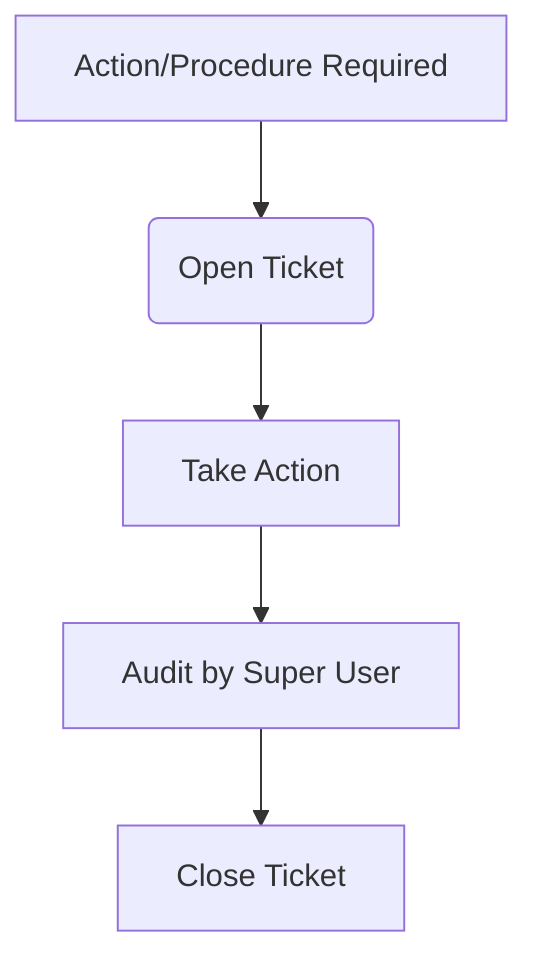
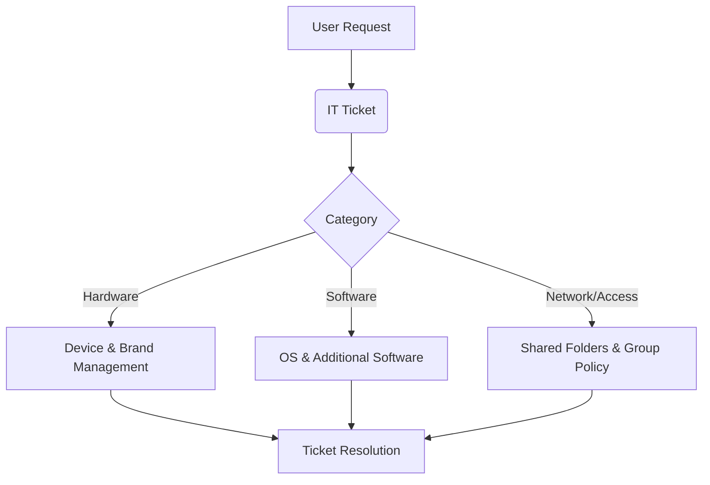
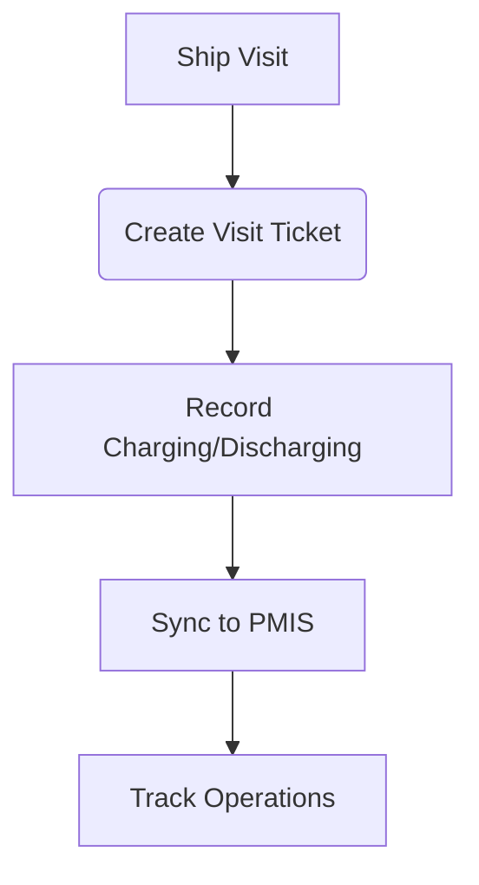
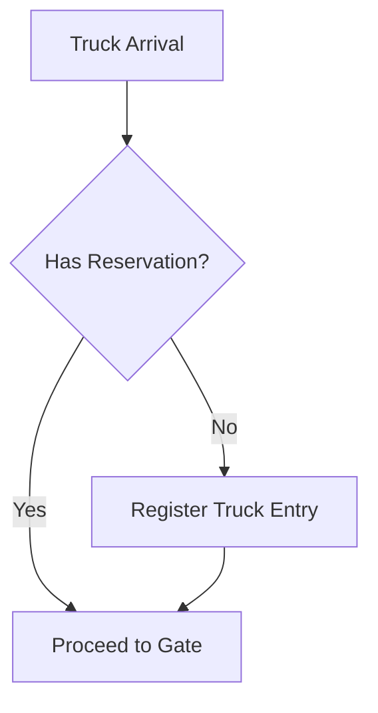

# Adabia Port

**Adabia Port** is a comprehensive management system designed to track and streamline business processes across various departments of the Adabia Port. It serves as a central hub for managing operations, support tickets, and infrastructure.

## Overview

The application is built on the Frappe Framework and integrates multiple modules to handle specific departmental needs:

- **Customer Tech Support**: A dedicated ticket system for customer technical support.
- **SPS System**: Project Management Information System (PMIS) for the SPS application team.
- **IT Support**: Help Desk and IT asset management.
- **Charging and Discharging**: Management of port operations related to cargo handling.
- **Gates**: Control and tracking of entry/exit points.

---

## Installation

Follow these steps to install the Adabia Port app on your Frappe Bench.

### Prerequisites
- A running [Frappe Bench](https://github.com/frappe/bench).
- `git` installed on your system.

### Steps

1.  **Get the App**:
    Navigate to your bench directory and fetch the app from the repository.
    ```bash
    cd $PATH_TO_YOUR_BENCH
    bench get-app https://github.com/blacksnowsoon/adabia_port --branch master
    ```

2.  **Install the App**:
    Install the app on your specific site.
    ```bash
    bench --site [your-site-name] install-app adabia_port
    ```

3.  **Migrate**:
    Run a migration to ensure all database schemas are updated.
    ```bash
    bench --site [your-site-name] migrate
    ```

4.  **Restart**:
    Restart your bench to apply changes.
    ```bash
    bench restart
    ```

---

## Modules & Features

### 1. Customer Tech Support
A ticket system designed to handle procedures taken against trucks, companies, or other entities within the department. Tickets are opened when an action is required, processed, and finally audited and closed by a Super User.



### 2. SPS System
Acts as a Project Management Information System (PMIS) for the application team, following a Kanban/Agile workflow. It tracks bugs, new requests, and queries from the operation team.

```mermaid
graph TD
  A[Bug / Request / Query] --> B(Open Ticket)
  B --> C[In Progress (Dev Team)]
  C --> D[Solved]
  D --> E[Close Ticket]
```

### 3. IT Support
A complete Help Desk solution for managing IT assets and support requests. It tracks devices, software, and user access rights.



### 4. Charging and Discharging
Manages the logistical operations for ship visits. A ticket is created for each visit to record charging and discharging activities, which are then synchronized with the PMIS for tracking over time.



### 5. Gates
A streamlined solution for managing truck entries. It specifically handles the registration of trucks arriving without prior reservations.



---

## Contributing

We welcome contributions! This app uses `pre-commit` for code quality.

1.  **Install Pre-commit**:
    ```bash
    pip install pre-commit
    ```

2.  **Setup**:
    ```bash
    cd apps/adabia_port
    pre-commit install
    ```

The following tools are used for linting and formatting:
- `ruff` (Python linting)
- `eslint` (JavaScript linting)
- `prettier` (Code formatting)
- `pyupgrade` (Python syntax upgrades)

---

## License

MIT
